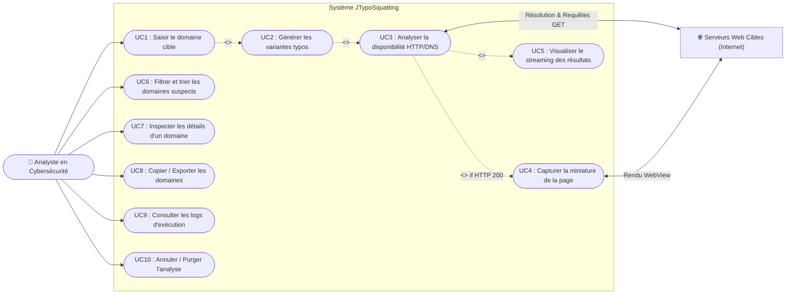
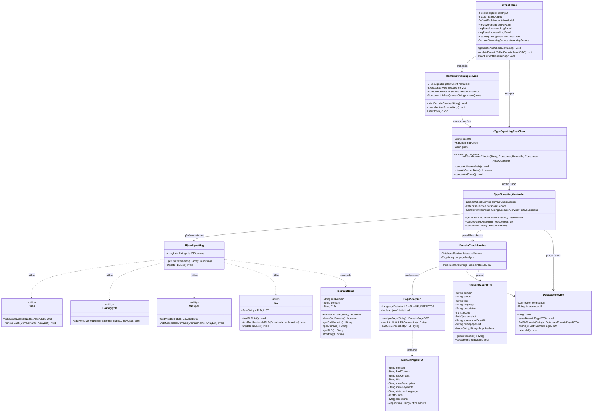
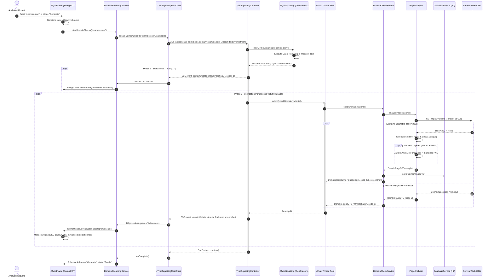
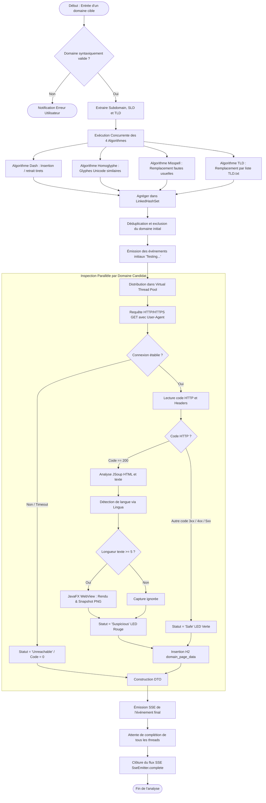
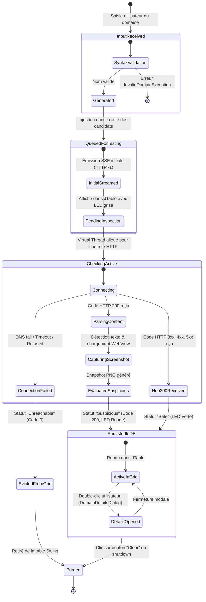
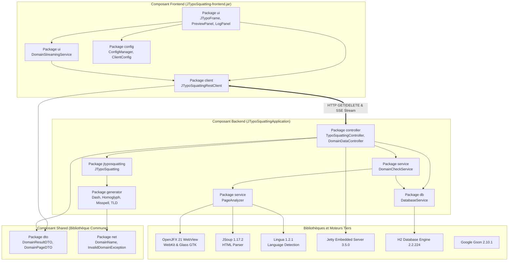

# Architecture Technique et Applicative — JTypoSquatting v2.0-alpha1

Ce document constitue la référence officielle de l'architecture technique et applicative du projet **JTypoSquatting**, un outil d'analyse et de détection de typo-squatting de noms de domaine destiné aux analystes en cybersécurité et professionnels de la protection de marque.

---

## Sommaire

1. [Vue d'Ensemble du Système](#1-vue-densemble-du-système)
2. [Périmètre et Exigences](#2-périmètre-et-exigences)
3. [Architecture Applicative (Logique)](#3-architecture-applicative-logique)
4. [Architecture Technique et d'Exécution](#4-architecture-technique-et-dexécution)
5. [Les 7 Schémas d'Architecture UML](#5-les-7-schémas-darchitecture-uml)
   - [5.1 Diagramme de Cas d'Utilisation (Use Case Diagram)](#51-diagramme-de-cas-dutilisation)
   - [5.2 Diagramme de Classes (Class Diagram)](#52-diagramme-de-classes)
   - [5.3 Diagramme de Séquence (Sequence Diagram)](#53-diagramme-de-séquence)
   - [5.4 Diagramme d'Activité (Activity Diagram)](#54-diagramme-dactivité)
   - [5.5 Diagramme d'États-Transitions (State Machine Diagram)](#55-diagramme-détats-transitions)
   - [5.6 Diagramme de Composants (Component Diagram)](#56-diagramme-de-composants)
   - [5.7 Diagramme de Déploiement (Deployment Diagram)](#57-diagramme-de-déploiement)
6. [Architecture des Données (H2 Database)](#6-architecture-des-données-h2-database)
7. [Architecture des Flux Réseau & API REST/SSE](#7-architecture-des-flux-réseau--api-restsse)
8. [Modèle de Sécurité](#8-modèle-de-sécurité)
9. [Performance et Concurrence (Virtual Threads)](#9-performance-et-concurrence-virtual-threads)

---

## 1. Vue d'Ensemble du Système

JTypoSquatting est conçu selon un modèle **Client-Serveur découplé** s'exécutant au sein d'un environnement local :
- **Frontend** : Application riche de bureau en **Java Swing** assurant l'interface utilisateur, la restitution tabulaire, le tri par priorité de risque, l'affichage des miniatures web et la consultation des logs en direct.
- **Backend** : Service applicatif **Spring Boot 3.5.0** hébergé sur le conteneur embarqué **Jetty**, exposant des endpoints REST et un flux d'événements temps réel (**Server-Sent Events - SSE**). Il exploite les **Virtual Threads** (Java 21 Project Loom) pour interroger massivement les cibles distantes.
- **Moteur d'Analyse et Rendu** : Un composant d'évaluation HTTP couplé à **JavaFX WebView** pour exécuter les scripts des pages cibles et réaliser une capture d'écran graphique des sites suspects.
- **Persistance Locale** : Base de données relationnelle embarquée **H2** stockant l'historique complet, les en-têtes HTTP, les métadonnées SEO/OpenGraph et les images capturées sous forme de BLOB.

---

## 2. Périmètre et Exigences

| Axe | Description | Priorité |
|---|---|---|
| **Génération algorithmique** | Générer l'ensemble des variations plausibles d'un domaine cible (tirets, homoglyphes visuels, fautes de frappe courantes, extensions TLD alternatives). | Haute |
| **Streaming temps réel** | Délivrer les statuts de vérification (Testing, Suspicious, Safe, Unreachable) au fil de l'eau via SSE sans figer l'interface graphique. | Haute |
| **Parallélisme massif** | Traiter des centaines de domaines simultanément sans saturation de mémoire grâce aux Virtual Threads (threads légers). | Haute |
| **Capture visuelle** | Générer une miniature PNG (320x240) de la page d'accueil des domaines répondant en HTTP 200 pour identifier le phishing ou le parking de domaine. | Moyenne |
| **Autonomie & Confidentialité** | Fonctionnement 100% autonome en local sans envoi de télémétrie ni dépendance cloud externe. | Haute |

---

## 3. Architecture Applicative (Logique)

Le système est décomposé en trois sous-projets Gradle :

```
JTypoSquatting/
├── shared/     # Modèles de données communs (DTO), abstractions domaine, exceptions
├── backend/    # API Spring Boot, générateurs d'algorithmes, moteur d'analyse, JDBC H2
└── frontend/   # Client Swing (JTypoFrame), client HTTP SSE, tailer de logs, affichage
```

### 3.1 Module Shared (`:shared`)
- **`DomainName`** : Objet valeur modélisant le nom de domaine, son sous-domaine éventuel, son étiquette de second niveau (SLD) et son suffixe public (TLD).
- **`DomainResultDTO`** : Objet de transfert de données diffusé par SSE et affiché dans la table Swing (statut, code HTTP, langue détectée, description, screenshot).
- **`DomainPageDTO`** : Entité riche décrivant les données complètes d'analyse d'une page web (HTML, texte brut, métadonnées OpenGraph, en-têtes HTTP).
- **`InvalidDomainException`** : Exception levée lors d'une validation syntaxique de domaine erronée.

### 3.2 Module Backend (`:backend`)
- **`TypoSquattingController`** : Contrôleur REST principal exposant `/api/generate-and-check` (SSE), `/api/cancel`, et `/api/cancel-and-clear`.
- **`DomainDataController`** : Contrôleur REST pour la consultation des domaines persistés (`/api/data/cached/{domain}`, `/api/data/all`, `/api/data/stats`).
- **`JTypoSquatting`** : Orchestrateur algorithmique agrégeant les résultats des différents générateurs typo.
- **Générateurs** (`generator/*`) :
  - `Dash` : Insertion et suppression systématique de tirets (`-`).
  - `Homoglyph` : Remplacement de caractères par des glyphes visuellement similaires (Cyrillique, Grec, Unicode).
  - `Misspell` : Injection d'erreurs orthographiques d'après une base de données de fautes fréquentes.
  - `TLD` : Remplacement du TLD d'origine par les extensions majeures répertoriées dans `TLD.txt`.
- **`DomainCheckService`** : Service intermédiaire gérant le cycle de contrôle d'un domaine individuel et la persistance en base.
- **`PageAnalyzer`** : Moteur d'analyse HTTP, extraction JSoup, détection de langue Lingua, et capture d'écran JavaFX WebView.
- **`DatabaseService`** : Couche d'accès aux données (DAO) s'appuyant sur JDBC H2.

### 3.3 Module Frontend (`:frontend`)
- **`JTypoFrame`** : Fenêtre principale Swing, intégrant la barre de saisie, la grille tabulaire triable, le panneau d'aperçu d'image et le gestionnaire d'onglets de logs.
- **`DomainStreamingService`** : Service client gérant la file d'attente d'événements SSE reçus et synchronisant les mises à jour avec l'Event Dispatch Thread (EDT) de Swing par lots configurables.
- **`JTypoSquattingRestClient`** : Client HTTP réalisant les appels vers l'API Spring Boot et lisant le flux continu d'événements.
- **`LogPanel` & `LogTailer`** : Lecteur asynchrone des fichiers de logs du backend et du frontend.
- **`DomainDetailsDialog`** : Fenêtre modale affichant les détails complets d'un domaine sélectionné (en-têtes HTTP, texte, métadonnées).

---

## 4. Architecture Technique et d'Exécution

```
+-------------------------------------------------------------------------------+
|                             Poste Client / OS Hôte                            |
|                                                                               |
|  +-------------------------------------+  +--------------------------------+  |
|  |           Processus Frontend        |  |        Processus Backend       |  |
|  |             (JVM Java 21+)          |  |         (JVM Java 21+)         |  |
|  |                                     |  |                                |  |
|  |  +-------------------------------+  |  |  +--------------------------+  |  |
|  |  |           UI Swing            |  |  |  |  Spring Boot 3.5.0       |  |  |
|  |  |  (JTypoFrame, PreviewPanel)   |  |  |  |  (Serveur Jetty :8080)   |  |  |
|  |  +---------------+---------------+  |  |  +------------+-------------+  |  |
|  |                  |                  |  |               |                |  |
|  |  +---------------v---------------+  |  |  +------------v-------------+  |  |
|  |  |    DomainStreamingService     |  |  |  |  Virtual Thread Pool     |  |  |
|  |  +---------------+---------------+  |  |  |  (Executors.newVirtual...) |  |  |
|  |                  |                  |  |  +------------+-------------+  |  |
|  |  +---------------v---------------+  |  |               |                |  |
|  |  |   JTypoSquattingRestClient    |  |  |  +------------v-------------+  |  |
|  |  +---------------+---------------+  |  |  |  JavaFX WebView + Xvfb   |  |  |
|  +------------------|------------------+  |  +------------+-------------+  |  |
|                     | HTTP / SSE                          |                |  |
|                     +------------------------------------>|                |  |
|                                                           |                |  |
|                                           +---------------v-------------+  |  |
|                                           |     H2 Database (Fichier)   |  |  |
|                                           |   typosquatting_db.mv.db    |  |  |
|                                           +-----------------------------+  |  |
+-----------------------------------------------------------|-------------------+
                                                            | Requêtes HTTPS
                                                            v
                                            +-----------------------------+
                                            |       Internet Public       |
                                            | (Serveurs Web cibles / DNS) |
                                            +-----------------------------+
```

---

## 5. Les 7 Schémas d'Architecture UML

### 5.1 Diagramme de Cas d'Utilisation

Ce diagramme décrit les interactions entre l'analyste en sécurité et le système JTypoSquatting, ainsi que les extensions et inclusions fonctionnelles.



---

### 5.2 Diagramme de Classes

Ce diagramme modélise la structure statique des classes applicatives à travers les couches de présentation, client, contrôleur, service, générateur et persistance.



---

### 5.3 Diagramme de Séquence

Ce diagramme détaille le flux temporel complet déclenché lors du clic sur le bouton **Generate**, de la requête SSE jusqu'à la mise à jour dynamique de la table et du panneau de prévisualisation.



---

### 5.4 Diagramme d'Activité

Ce diagramme modélise l'algorithme complet de génération, de filtrage et d'évaluation d'un domaine candidat.



---

### 5.5 Diagramme d'États-Transitions

Ce diagramme présente le cycle de vie complet d'un domaine au sein du système, de sa saisie à sa persistance ou son éviction de la grille.



---

### 5.6 Diagramme de Composants

Ce diagramme illustre les modules logiciels, les dépendances externes et les interfaces de communication.



---

### 5.7 Diagramme de Déploiement

Ce diagramme décrit l'implantation physique et les nœuds d'exécution sur le système d'exploitation cible.

```mermaid
flowchart TB
    subgraph HostSystem [" 💻 Machine Hôte (Linux / Windows) "]
        subgraph DisplaySubsystem [" Sous-système Graphique "]
            XServer[" Serveur X11 / Xvfb (:99)\n(Requis pour rendu JavaFX Headless sous Linux) "]
        end

        subgraph JVM_Frontend [" ☕ JVM 1 - Processus Client "]
            FatJar[" Archive fatJar : JTypoSquatting.jar\nMain-Class: com.aleph...ui.JTypoFrame "]
            SwingAWT[" Java Desktop (AWT / Swing)\nComposants graphiques, tables, rendus "]
            FatJar --- SwingAWT
        end

        subgraph JVM_Backend [" ☕ JVM 2 - Processus Serveur (Spring Boot) "]
            BootApp[" Application Spring Boot : JTypoSquattingApplication\nConteneur Jetty embarqué sur port 8080 "]
            VThreads[" Virtual Thread Pool (Java 21 Project Loom) "]
            FXEngine[" JavaFX Runtime Engine (Prism SW, WebKit libjfxwebkit.so) "]
            BootApp --- VThreads
            BootApp --- FXEngine
        end

        subgraph LocalFileSystem [" 📁 Système de Fichiers Local "]
            DBFile[(" Base H2 : backend/typosquatting_db.mv.db ")]
            LogBackend[" Log Backend : /tmp/jtypo-backend.log "]
            LogFrontend[" Log Frontend : /tmp/jtypo-frontend.log "]
            ResourceTLD[" Ressource : TLD.txt "]
            ResourceMisspell[" Ressource : common-misspellings.json "]
        end
    end

    subgraph RemoteNetwork [" 🌐 Réseau Extérieur / Internet "]
        DNS[" Résolveurs DNS mondiaux "]
        WebServers[" Serveurs HTTP/HTTPS distants (Domaines squattés cibles) "]
    end

    %% Liaisons
    SwingAWT -.->|Affiche fenêtre UI| XServer
    FXEngine -.->|Rendu off-screen DISPLAY=:99| XServer

    JVM_Frontend <===>|Loopback HTTP 127.0.0.1:8080\nREST & Server-Sent Events| JVM_Backend

    BootApp --> DBFile
    BootApp --> LogBackend
    FatJar --> LogFrontend
    BootApp --> ResourceTLD
    BootApp --> ResourceMisspell

    JVM_Backend <===>|Requêtes DNS UDP 53| DNS
    JVM_Backend <===>|Requêtes HTTP / HTTPS (TCP 80, 443)| WebServers
```

---

## 6. Architecture des Données (H2 Database)

### 6.1 Modèle Physique de Données

La base de données embarquée H2 enregistre les données de diagnostic détaillées dans la table `domain_page_data` :

```sql
CREATE TABLE IF NOT EXISTS domain_page_data (
    domain VARCHAR(255) PRIMARY KEY,
    html_content TEXT,
    text_content TEXT,
    meta_description TEXT,
    meta_keywords VARCHAR(1000),
    meta_author VARCHAR(500),
    meta_og_title VARCHAR(500),
    meta_og_description VARCHAR(1000),
    detected_language VARCHAR(10),
    timestamp BIGINT,
    http_code INTEGER,
    http_headers TEXT,
    screenshot BLOB
);
```

### 6.2 Dictionnaire des Attributs

| Colonne | Type SQL | Rôle et Description |
|---|---|---|
| `domain` | VARCHAR(255) | Clé primaire unique représentant le nom de domaine analysé. |
| `html_content` | TEXT | Code HTML brut récupéré lors de la requête GET initiale (tronqué à 3000 lignes). |
| `text_content` | TEXT | Contenu textuel nettoyé des balises HTML extrait par JSoup. |
| `meta_description`| TEXT | Valeur de la balise `<meta name="description">`. |
| `meta_keywords` | VARCHAR(1000)| Mots-clés déclarés dans `<meta name="keywords">`. |
| `meta_og_title` | VARCHAR(500) | Titre pour les réseaux sociaux `<meta property="og:title">`. |
| `detected_language`| VARCHAR(10) | Code ISO de la langue prédominante identifiée par la librairie Lingua. |
| `timestamp` | BIGINT | Horodatage de l'analyse (millisecondes Epoch). |
| `http_code` | INTEGER | Code de réponse HTTP (200, 301, 404, 500 ou 0 si injoignable). |
| `http_headers` | TEXT | En-têtes de réponse HTTP sérialisés au format JSON. |
| `screenshot` | BLOB | Image binaire miniature PNG (320x240 pixels) compressée. |

---

## 7. Architecture des Flux Réseau & API REST/SSE

Le backend expose un ensemble d'API documentées ci-dessous :

### 7.1 Endpoints Principaux

| Méthode | URI | Type MIME | Rôle |
|---|---|---|---|
| `GET` | `/api/generate-and-check?domain={domain}` | `text/event-stream` | Déclenche la génération algorithmique et diffuse les statuts via SSE au fil de l'eau. |
| `GET` | `/api/cancel` | `application/json` | Interrompt immédiatement tous les Virtual Threads de vérification en cours. |
| `DELETE`| `/api/cancel-and-clear` | `application/json` | Interrompt l'analyse active et purge intégralement la table H2. |
| `GET` | `/api/data/analyze?domain={domain}` | `application/json` | Analyse synchrone unitaire d'un unique domaine. |
| `GET` | `/api/data/cached/{domain}` | `application/json` | Récupère les données persistées pour un domaine spécifique. |
| `GET` | `/api/data/all` | `application/json` | Retourne la liste complète des analyses sauvegardées. |
| `DELETE`| `/api/data/all` | `application/json` | Purge toutes les données en base sans toucher aux processus. |
| `GET` | `/api/data/stats` | `application/json` | Retourne les métriques globales (nombre de domaines persistés). |

### 7.2 Format des Événements SSE (`domainUpdate`)

Chaque événement SSE émis sur le canal `domainUpdate` encapsule un objet JSON correspondant au `DomainResultDTO` :

```json
{
  "domain": "www.ex-ample.com",
  "status": "Suspicious",
  "title": "Example Domain Phishing Portal",
  "language": "ENGLISH",
  "description": "Portail frauduleux...",
  "httpCode": 200,
  "screenshotBase64": "iVBORw0KGgoAAAANSUhEUgAAAUAAAA...",
  "homepageText": "Welcome to your account login...",
  "httpHeaders": {
    "Server": "Apache/2.4.41",
    "Content-Type": "text/html; charset=UTF-8"
  }
}
```

---

## 8. Modèle de Sécurité

### 8.1 Périmètre de Confiance Local
- L'application s'exécute localement sur la machine de l'analyste. Les flux REST et SSE transitent exclusivement via l'interface loopback locale (`http://localhost:8080`).
- Aucune donnée n'est transmise à un serveur tiers ou cloud.

### 8.2 Interactions avec des Domaines Suspects
- Les cibles interrogées étant par nature potentiellement malveillantes (sites de phishing, scam, serveurs C2), le moteur isole l'analyse :
  - Utilisation d'un User-Agent générique masquant la signature de l'outil.
  - Définition de timeouts stricts (connexion 3s, lecture 10s) pour prévenir les attaques de type Slowloris.
  - Exécution du moteur JavaFX WebView sans cookies ni stockage persistant partagé.

---

## 9. Performance et Concurrence (Virtual Threads)

L'architecture s'appuie sur le modèle de concurrence légère introduit avec **Java 21 (Project Loom)** :
- **Virtual Threads** : Pour chaque domaine généré (généralement 100 à 300 variantes), une tâche de contrôle I/O bloquante est soumise à un exécuteur virtuel (`Executors.newVirtualThreadPerTaskExecutor()`).
- **Débit Élevé sans Surcoût Mémoire** : Contrairement aux threads de plateforme (qui allouent 1 Mo de pile par défaut), les Virtual Threads n'occupent que quelques kilooctets sur le tas et sont automatiquement désordonnancés lors des attentes réseau (I/O non-bloquantes pour le CPU hôte).
- **Consommation GUI Régulée** : Pour éviter d'engorger l'Event Dispatch Thread (EDT) de Swing lors de l'arrivée massive d'événements SSE, le `DomainStreamingService` applique une file d'attente concurrente (`ConcurrentLinkedQueue`) dépilée par paquets (batch de 50 items avec tempo de 200ms).
